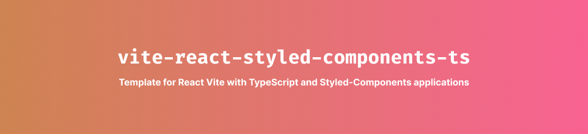

<div align='center'>
  
</div>

# 🚀 Setup

- **npm**
- [React](https://pt-br.reactjs.org/)
- [TypeScript](https://www.typescriptlang.org/)
- [Vite](https://vitejs.dev/)
- [Styled-Components](https://styled-components.com/)
- [ESLint](https://eslint.org/)
- Editorconfig
- [Commitizen](https://www.conventionalcommits.org/en/v1.0.0/)

### Libraries

- Radix
- React Router DOM
- Axios

### Optional not installed

- Phosphor Icons
- React Icons

## 📥 Commands to initialize project
| Command           | Action                                       |
|:----------------  |:-------------------------------------------- |
| `npm install`     | Installs dependencies                        |
| `npm run dev`     | Starts local dev server at `localhost:3000`  |
| `npm run build`   | Build your production site to `./dist/`      |
| `npm run preview` | Preview your build locally, before deploying |


## 📂 Project Structure

Inside of your Boilerplate, you'll see the following folders and files:

```

├── public/
│   └── favicon.ico
├── src/
│   ├── components/
│   │   └── Heading
│   │
│   ├── contexts/
│   │   └── Context
│   │
│   ├── hooks/
│   │      └── useHook
│   │
└── pages/
│         └── Home
└── package.json
